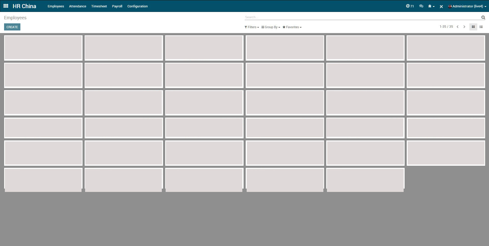
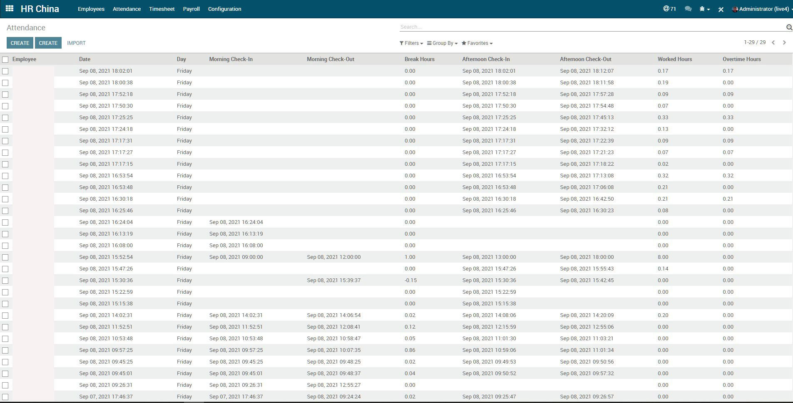

# Odoo ERP Custom HR Module
Odoo ERP Custom Human Resource Module

### ERP Module Features
- Employee List
- Attendance
  - Attendance
  - Attendance Kiosk
- Timesheet
- Payroll
- Configuration
  - Contract Template
  - Benefits Template
  - Deduction Template
  - Holidays
  - Special Working Days
  - Payment Method
  - Company Name & Logo
  - Job Title/Position
  - Departments

## Employee List
Show list of all employee and employee public and personal information such as contracts.

## Attendance
Can see and edit attendance information of the employee. The Kiosk supports barcode scanning for automatic attendance.

> Will add more details in the future
